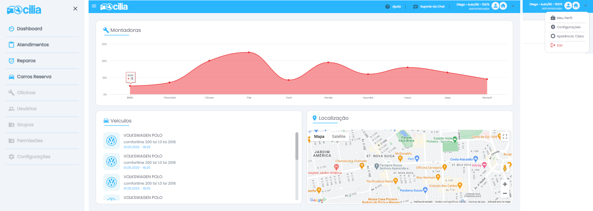
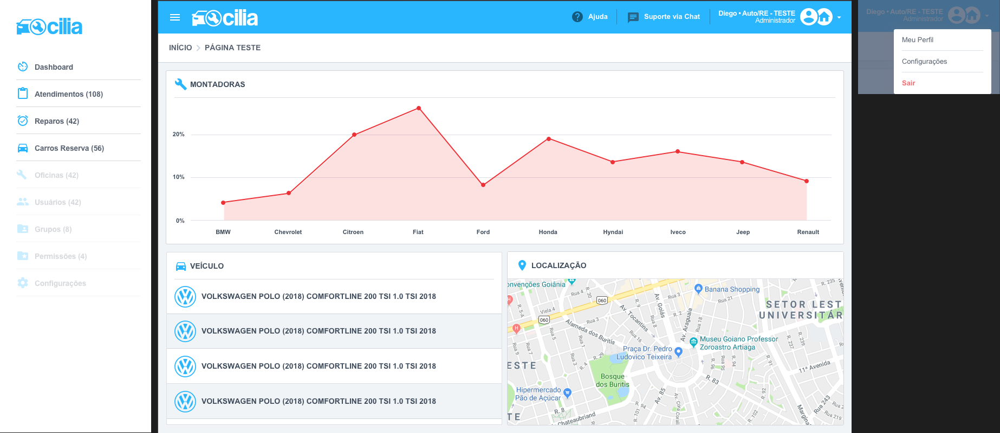

    

# Cillia FrontEnd Test

## Finished Project

 

    

 
 

---

## Project Requirements

- Prototype
    

        
    

- Programming must be in English: class names, methods, variables.

- The project does not need to be done in its entirety, we will evaluate how far have you managed to get.

- The implementation must be done with the [`Vue.js framework`](https://vuejs.org/). If you need to use external libraries, we recommend using [`Material Icons`](https://fonts.google.com/icons?selected=Material+Icons), [`Google Maps`](https://developers.google.com/maps/documentation/javascript/?hl=pt-br) and [`Highcharts`](https://www.highcharts.com/demo).

- Submission time: 1 week from receipt of test by email.

### Differential (if you manage to finish the initial project with ease and want to go further to improve your rating):

- Using [`Bootstrap`](https://getbootstrap.com/) or [`Element Plus`](https://element-plus.org/)

- Responsive Interface

- Using [`Sass/Scss`](https://sass-lang.com/)

- Assets organization
